[Collaborators]{.alertblue}

-  [Robert Kohn]{.alertred}, University of New South Wales, Sydney.

-  [Ganna Fagerberg]{.alertred}, Stockholm University

-  [Yijie Niu]{.alertred}, Stockholm University

-  [Oskar Gustafsson]{.alertred}, Stockholm University

<hr>

[Funding]{.alertblue}

- Swedish Research Council, grants 2020-02846 and 2025-01654. 

<hr>

:::: {.columns}
::: {.column width="50%"}
[Slides]{.alertblue}

<br>
[mattiasvillani.com/seminars/nordstat2026](mattiasvillani.com/seminars/nordstat2026)
:::
::: {.column width="50%" style="text-align:right;"}
{width="5%" style="vertical-align: bottom;"} [Julia packages (unoptimized, ongoing)]{.alertblue}

```{=html}
<div style="position: relative; display: inline-block; width: 20%;"
     onmouseenter="this.querySelector('.popup').style.display='block'"
     onmouseleave="this.querySelector('.popup').style.display='none'">
  
  <div class="popup" style="
    display: none;
    position: absolute;
    bottom: 105%;
    right: 0;
    z-index: 100;
    background: white;
    border: 1px solid #ccc;
    padding: 4px;
    border-radius: 4px;
    width: 600px;
  ">
    
  </div>
</div>
```
[https://github.com/compbayes](https://github.com/compbayes)
:::
::::


---

## Outline

0.  Time-varying parameters and state-space models
1.  Dynamic shrinkage process priors
2.  Time-varying multi-seasonal ARMA
3.  Non-Gaussian models
4.  Posterior inference


------------------------------------------------------------------------

## Time-varying parameter models

-   Regression with [time-varying parameters]{.alertred}

$$
\begin{aligned}
y_{t} &= \v x_{t}^{\top}\v\beta_{t}+\varepsilon_{t}\qquad
\varepsilon_{t}\overset{\mathrm{iid}}{\sim}N(0,\sigma_{\varepsilon}^{2}) \\
\v\beta_{t} &= \v\beta_{t-1}+\boldsymbol{\nu}_{t}\hspace{2.1cm} 
\v\nu_{t}\overset{\mathrm{iid}}{\sim}N(\v 0,\v\Sigma_{\nu})
\end{aligned}
$$

::: mediumskip
:::

-   [Linear Gaussian state-space model]{.alertred} $$
    \begin{aligned}
    \text{Observation model:}\qquad\qquad\qquad \v y_{t} &=
    \v C_t\v\theta_{t}+\v\varepsilon_{t}\qquad
    &\v\varepsilon_{t}\overset{\mathrm{iid}}{\sim}N(\v 0,\v\Sigma_{\varepsilon, t}) \\
    \text{Transition model:}\qquad\qquad\qquad\hspace{0.6cm} \v\theta_{t} 
    &=\v A_t \v\theta_{t-1}+\boldsymbol{\nu}_{t}\hspace{2.1cm} 
    &\v\nu_{t}\overset{\mathrm{iid}}{\sim}N(\v 0,\v\Sigma_{\nu, t})
    \end{aligned}
    $$ with state $\v \theta_t=\v\beta_t$, $\v C_t = \v x_t^\top$ and $\v A_t = \v I_p$.
    
::: smallskip
:::

- [Initial prior]{.alertred} at time $t=0$
    $$
    \v\theta_0 \sim N(\v\mu_0,\v\Omega_0)
    $$

## Regression with time-varying parameters

::: iframe-slide
<iframe width="100%" height="787" frameborder="0"
  src="https://observablehq.com/embed/2eac471324f40b89?cells=viewof+input%2Cviewof+obsnumber%2Cviewof+simulatebutton%2Cbothplots&banner=false"></iframe>
:::

## Taxonomy of state-space models

-   [Linear Gaussian]{.alertred}

$$
\begin{aligned}
\v y_{t} &=
\v C_t\v\theta_{t}+\v\varepsilon_{t}\qquad
&\v\varepsilon_{t}\overset{\mathrm{iid}}{\sim}N(\v 0,\v\Sigma_{\varepsilon,t}) \\
\v\theta_{t} 
&=\v A_t \v\theta_{t-1}+\boldsymbol{\nu}_{t}\qquad 
&\v\nu_{t}\overset{\mathrm{iid}}{\sim}N(\v 0,\v\Sigma_{\nu,t})
\end{aligned}
$$

-   [Non-linear Gaussian]{.alertred} (additive) models

$$
    \begin{aligned}
    \v y_{t} &=
    \v c_t(\v\theta_{t}) + \v\varepsilon_{t}\qquad
    &\v\varepsilon_{t}\overset{\mathrm{iid}}{\sim}N(\v 0,\v\Sigma_{\varepsilon,t}) \\
    \v\theta_{t} 
    &=\v a_t(\v\theta_{t-1})+\boldsymbol{\nu}_{t}\qquad
    &\v\nu_{t}\overset{\mathrm{iid}}{\sim}N(\v 0,\v\Sigma_{\nu,t})
    \end{aligned}
$$

-   [Non-Gaussian]{.alertred} - general distributions

$$
    \begin{aligned}
    \v y_{t} &\sim p_t(\v y_{t} \vert \v\theta_t) \\
    \v\theta_{t} &\sim q_t(\v\theta_{t} \vert \v\theta_{t-1})
    \end{aligned}
$$

## Bayesian inference in state-space models

- [Filtering posterior]{.alertred} (instantaneous) $p(\v\theta_{t}\vert y_{1:t})$

{width="20%"}  

- [Smoothing posterior]{.alertred} (retrospective) $p(\v\theta_{t}\vert y_{1:T})$

{width="20%"} 

- [Joint smoothing posterior]{.alertred} 
$p(\v\theta_{1:T}\vert y_{1:T})$

{width="20%"} 

------------------------------------------------------------------------

## Global-local shrinkage priors - regression [@carvalho2010horseshoe; @polson2010shrink] [@piironen2017sparsity]

- Linear Gaussian regression with [horseshoe prior]{.alertred}
$$
\begin{aligned}
y_i &=  \v x_i^\top\v\beta + \varepsilon_i,\quad \varepsilon_i \overset{\mathrm{iid}}{\sim}N(0,\sigma^2_\varepsilon) \\
\beta_j &\overset{\mathrm{ind}}{\sim} N(0,\blue{\tau^2}\red{\lambda^2_j}) \\
\tau &\sim C^+(0,1) \\
\lambda_j &\overset{\mathrm{iid}}{\sim} C^+(0,1)
\end{aligned}
$$
- Posterior mean (for orthogonal $\v x$) equals shrunken ML estimator
$$
\tilde{\beta}_j = (1-\kappa_j)\hat\beta_j
$$

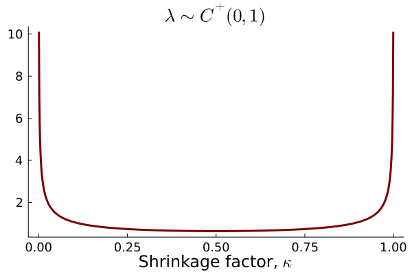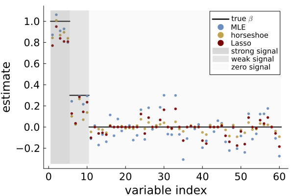


## Dynamic global-local shrinkage priors for time series [@kowal2019dynamic]

:::::: cols-2

<div>
- [Local level model - dynamic shrinkage process (DSP) prior]{.alertred}
$$
\begin{aligned}
y_t & = \mu_t + \varepsilon_t \hspace{4.3cm} \varepsilon_t \overset{\mathrm{iid}}{\sim} N(0,\sigma^2_\varepsilon) \\
\mu_t &= \mu_{t-1} + \nu_t, \hspace{3.0cm} \nu_t \overset{\mathrm{ind}}{\sim} N \big(0,\blue{\tau^2}\red{\exp(h_t)}\big) \\
h_t &= \rho h_{t-1}  + \eta_t,\hspace{2.5cm} \eta_t \overset{\mathrm{iid}}{\sim}Z(\alpha,\beta,0,1) \\
\tau &\sim C^+(0,1)
\end{aligned}
$$

::: tinyskip
:::
    
    
-   [Global variance]{.alertblue} $\blue{\tau^2}$
-   [Local variance]{.alertred} $\red{\lambda^2_t=\exp(h_t)}$

::: smallskip
:::
    
-   DSP becomes horseshoe when $\rho=0$:
$$
h_t \sim Z(\alpha,\beta,0,1) \Longleftrightarrow \lambda_t = \exp(h_t/2) \sim C^+(0,1)
$$

</div>

<div>

::: iframe-slide
<iframe width="100%" height="781" frameborder="0" src="https://observablehq.com/embed/@mattiasvillani/local-level-dsp-simple?cells=viewof+input%2Cviewof+plotselector%2Cviewof+simulatebutton%2Ctimeplot&amp;banner=false">

</iframe>

</iframe>
:::

</div>
::::::

------------------------------------------------------------------------

## Logistic-Beta distribution (Fisher's $Z$)

:::::: cols-2
<div>

-   $X\sim \mathrm{Beta}(\alpha,\beta)$ then $$Z := \log\Big(\frac{X}{1-X}\Big) \sim Z(\alpha,\beta,0,1)$$

-   Location-scale: $$\mu + \sigma Z  \sim  Z(\alpha,\beta,\mu,\sigma)$$

-   [Heavy tails]{.alertred} - log density decays linearly.

    ::: smallskip
    :::

-   Mean-variance mixture of Gaussians [@barndorff1982normal] $$
    \begin{aligned}
    Z \vert \xi &\sim N \big(\xi^{-1}(\alpha-\beta)/2,\xi^{-1}\big)  \\ 
    \xi &\sim \mathrm{PolyaGamma}(\alpha+\beta,1) 
    \end{aligned}
    $$

</div>

<div>

::: iframe-slide
<iframe width="100%" height="684" frameborder="0" style="display:block; margin:auto;" src="https://observablehq.com/embed/@mattiasvillani/zdist_simple@1010?cells=viewof+myinputs%2Cviewof+options%2Cplt&amp;banner=false">

</iframe>
:::

</div>
::::::

------------------------------------------------------------------------

## Multi-seasonal ARMA with DSP prior [@fagerberg2026time]

-   Seasonal AR with DSP evolution $$
    \phi_{p,t}(L)\Phi_{P,t}(L^{s})(y_{t}-\mu_t) = \varepsilon_{t},\quad\varepsilon_{t}\overset{\mathrm{iid}}{\sim}N(0,\sigma_{t}^{2})
    $$

-   SAR(1,1) as a [nonlinear Gaussian regression]{.alertred}
$$
y_t=\v z_t^{\top}\tilde{\v \phi}+\varepsilon_t
$$
$\tilde{\boldsymbol{\phi}}=(\phi_1,\Phi_1,\red{-\phi_1\Phi_1})^{\top}$ and $\boldsymbol{z}_{t}=(x_{t-1},x_{t-s},x_{t-(1+s)})^{\top}$


-   Extensions

    <ul style="list-style:none; padding:0; accent-color: #6C8EBF;">

    <li><input type="checkbox" checked> [Multi-seasonal]{.alertred} (daily, weekly, yearly cycle)</li>

    <li><input type="checkbox" checked> ARMA and Exact likelihood</li>

    <li><input type="checkbox" checked> Stochastic volatility with DSP priors</li>

    <li><input type="checkbox"> Multi-seasonal forecasting</li>

    <li><input type="checkbox"> Multi-seasonal VAR</li>

    </ul>


## Stability restrictions

:::::: cols-2

<div>

[Transformation to stability at every $t$]{.alertred} [@Barndorff-Nielsen1973] 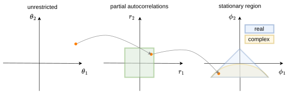{width="100%" fig-align="center"}

::: {.callout-important appearance="simple" icon="false" style="width: 100%;"}
## Lemma - uniform prior over the stability region [@fagerberg2026time; @jones2003skew]

The AR parameters $\v\phi$ are uniformly distributed over the stability region if, independently, \begin{equation}\label{eq:t_odd_even}
\theta_k \sim
    \begin{cases}
       t\big(k+1,0,\frac{1}{\sqrt{k+1}}\big) & \text{ for } k \text{ is odd}\\
       t_\mathrm{skew}\big(\frac{k}{2},\frac{k+2}{2}, 0, \frac{1}{\sqrt{k+1}}\big) & \text{ for } k \text{ is even}
    \end{cases}
\end{equation}
:::

- Same restriction on each AR polynomial.

- Same restriction for invertibility of MA.

</div>
<div>

::: {.tight-list}
<div style="font-size:0.9em;">
- Transformation to partial autocorr matters
    - [Monahan]{.alertblue} $$r=\frac{\theta}{\sqrt{1+\theta^{2}}}$$
    - [Tanh]{.alertgold} $$r=\frac{e^{\theta}-e^{-\theta}}{e^{\theta}+e^{-\theta}}$$
    - [Hard-tanh]{.alertred}
  $$
      r=\begin{cases}
      -(1-\epsilon) & \text{if }\theta\leq-(1-\epsilon)\\[6pt]
      \theta & \text{if }-(1-\epsilon)<\theta<1-\epsilon\\[6pt]
      1-\epsilon & \text{if }\geq1-\epsilon
    \end{cases}
  $$
</div>
::: 
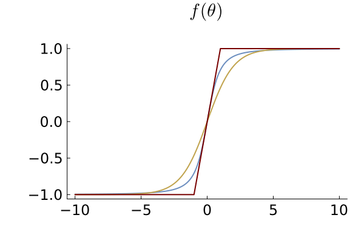{width="55%" fig-align="center"}
</div>

:::::: 

------------------------------------------------------------------------

## Seasonal AR with DSP prior - US industrial production 1919-2024

::::: cols-2
<div>

[SAR(1,2) - Homoscedastic Gaussian]{.alertred} 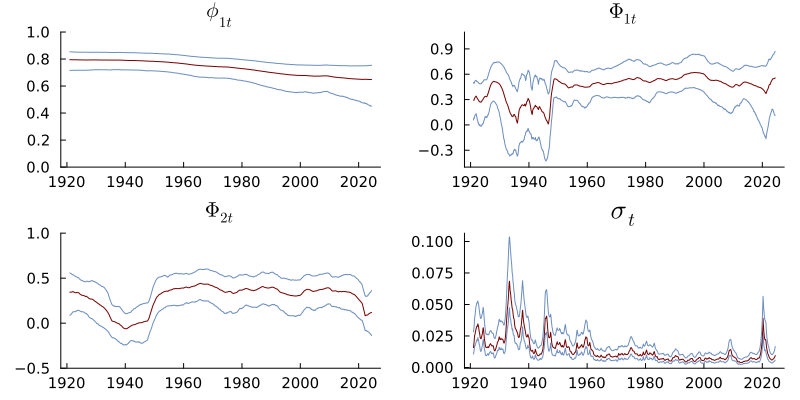{width="100%"}

</div>

<div>

[SAR(1,2) - DSP]{.alertred} 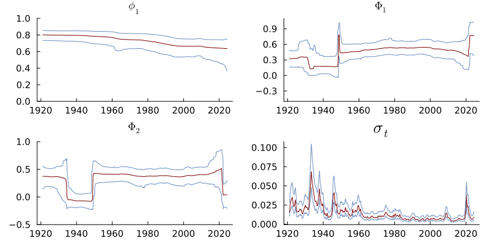{width="100%"}

</div>
:::::


## Time-varying generalized linear models with DSP evolution

::::::: cols-2
<div>

-   [GLMs]{.alertred} with time-varying parameters

$$
\begin{aligned}
y_t \vert \v x_{t} &\sim \mathrm{ExpFamily}\Big(k(\v x_{t}^\top\v\beta_{t}), \varphi_t  \Big) \\
\v\beta_{t} &= \v\beta_{t-1}+\boldsymbol{\nu}_{t},\hspace{2cm} 
\v\nu_{t}\overset{\mathrm{iid}}{\sim}N\big(\v 0,\mathrm{Diag}(\exp(\v\tau^2 \odot  \v h_t))\big) \\
\v h_t &= \Phi \v h_{t-1} + \v\eta_t,\hspace{1.6cm} \eta_{tk} \overset{\mathrm{iid}}{\sim}Z(\alpha,\beta,0,1)
\end{aligned}
$$

::: smallskip
:::

-   [Poisson regression]{.alertred} with DSP prior

$$
\begin{aligned}
y_t \vert \v x_{t} &\sim \mathrm{Pois}\big(\mu_t = \exp(\v x_{t}^\top\v\beta_{t}) \big) 
\end{aligned}
$$

::: smallskip
:::


-   [Beta regression]{.alertred} with DSP prior

$$
\begin{aligned}
y_t \vert \v x_{t}, z_{t} &\sim \mathrm{Beta}\big(\red{\mu_t = \mathrm{logistic}(\v x_{t}^\top\v\beta_{t})}, \, \blue{\phi_t = \exp(\v z_{t}^\top\v\gamma_{t})} \big) 
\end{aligned}
$$
</div>

<div>

::: iframe-slide
<iframe width="100%" height="781" frameborder="0" src="https://observablehq.com/embed/8180c0583931801b@1476?cells=viewof+input%2Cviewof+plotselector%2Cviewof+simulatebutton%2Ctimeplot&amp;banner=false">

</iframe>
:::

</div>
:::::::

## Bayesian inference in state-space models with DSP prior

- Joint smoothing posterior ($\v\psi$ holds all static parameters): 
$$p(\v\theta_{1:T}, \v h_{1:T}, \v\psi \vert y_{1:T})$$

::: smallskip
:::

- Gibbs sampling/MCMC

::: smallskip
:::

- Particle MCMC

::: smallskip
:::

- Hamiltonian Monte Carlo (HMC)

::: smallskip
:::

- Variational approximations

::: smallskip
:::

- Integrated Nested Laplace Approximation (INLA)?
  
## Gibbs sampling in linear Gaussian model with DSP prior

- Linear Gaussian regression with DSP evolution

$$
\begin{aligned}
y_t  &=\v x_{t}^\top\v\beta_{t} + \varepsilon_t,\hspace{1.6cm} \varepsilon_t \overset{\mathrm{ind}}{\sim}N(0,\sigma_\varepsilon^2) \\
\v\beta_{t} &= \v\beta_{t-1}+\boldsymbol{\nu}_{t},\hspace{2cm} 
\v\nu_{t}\overset{\mathrm{iid}}{\sim}N\big(\v 0,\mathrm{Diag}(\exp(\v\tau^2 \odot  \v h_t))\big) \\
\v h_t &= \Phi \v h_{t-1} + \v\eta_t,\hspace{1.6cm} \eta_{tk} \overset{\mathrm{iid}}{\sim}Z(\alpha,\beta,0,1)
\end{aligned}
$$

- [Polya-Gamma augmentation]{.alertred} to turn $Z$-distribution into conditionally Gaussian. [@kowal2019dynamic; @polson2013bayesian]

::: smallskip
:::

- [Square-and-log trick]{.alertred} to turn variance $\exp(h_t)$ into a mean $h_t$. [@kim1998stochastic]

::: smallskip
:::

- Fast sampling of $\v h_{1:T}$ using [sparse multivariate Gaussian]{.alertred} [@rue2001fast]. 

::: smallskip
:::

- [Forward-filtering-backward sampling]{.alertred} (FFBS) to sample $\v\beta_{1:T}$ [@carter1994gibbs; @fruhwirth1994data]


## Gaussian approximation filters

:::: {.columns}
::: {.column width="70%"}

- [Forward-filtering-backward sampling]{.alertred} for linear Gaussian models [@carter1994gibbs; @fruhwirth1994data]
  - Run Kalman filter $p(\v\theta_t\vert y_{1:t})$ forward for $t=1,2,\ldots,T$
  - Sample $p(\v\theta_{t}\vert \v\theta_{t+1}, y_{1:T})$ backward for $t=T,T-1,\ldots,1$
  
- Non-linear/non-Gaussian: replace the filtering step with an approximate filter.

- [Prior propagation]{.alertred}: approximate the joint distribution $$\left(\begin{array}{c}
\v\theta_{t}\\
\v\theta_{t-1}
\end{array}\right)\mid\boldsymbol{y}_{1:t-1}\overset{\mathrm{approx}}{\sim}N\left[\left(\begin{array}{c}
\mathbb{E}(\v\theta_{t})\\
\mathbb{E}(\v\theta_{t-1})
\end{array}\right),\left(\begin{array}{cc}
\mathbb{V}(\v\theta_{t}) & \mathbb{C}(\v\theta_{t},\v\theta_{t-1})\\
\mathbb{C}(\v\theta_{t},\v\theta_{t-1})^{\top} & \mathbb{V}(\v\theta_{t-1})
\end{array}\right)\right]$$

- [Observation update]{.alertred}: approximate the joint distribution $$\left(\begin{array}{c}
\boldsymbol{y}_{t}\\
\v\theta_{t}
\end{array}\right)\mid\boldsymbol{y}_{1:t-1}\overset{\mathrm{approx}}{\sim}N\left[\left(\begin{array}{c}
\mathbb{E}(\boldsymbol{y}_{t})\\
\mathbb{E}(\v\theta_{t})
\end{array}\right),\left(\begin{array}{cc}
\mathbb{V}(\boldsymbol{y}_{t}) & \red{\mathbb{C}(\boldsymbol{y}_{t},\v\theta_{t})}\\
\mathbb{C}(\boldsymbol{y}_{t},\v\theta_{t})^{\top} & \mathbb{V}(\v\theta_{t})
\end{array}\right)\right]$$

:::

::: {.column width="30%"}

::: bigskip
:::


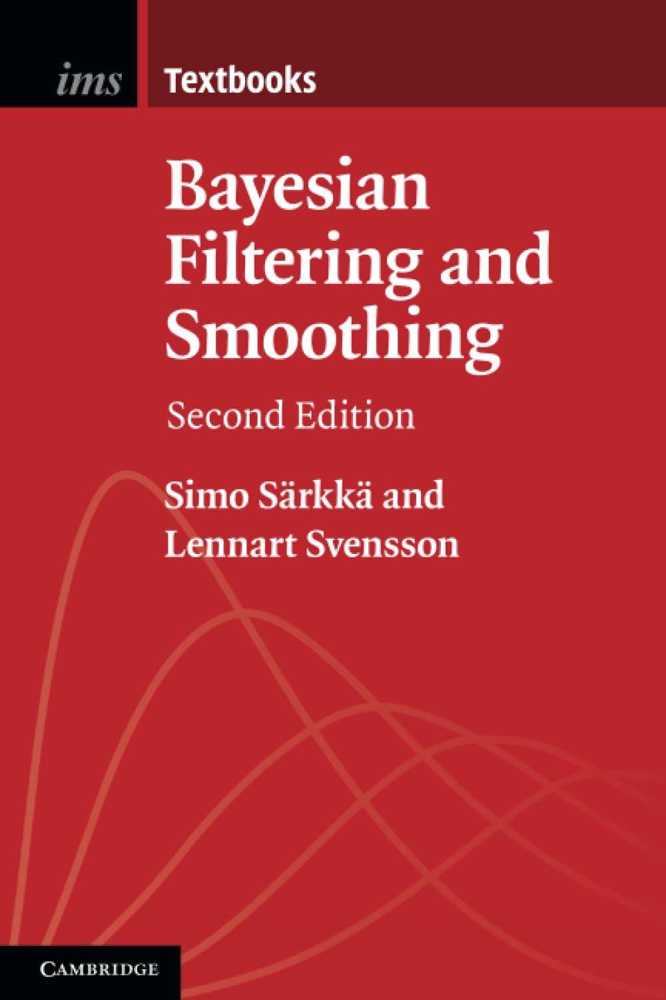{width="50%" style="display: block; margin: auto;"}

:::

::::


## Gaussian approximation filters

:::: {.columns}
::: {.column width="70%"}

- [Extended Kalman filter]{.alertred}
  - Linearize measurement/transition models
  - Apply standard Kalman filter

- [Unscented Kalman filter]{.alertred}
  - Propagate sigma point approx of prior
  
  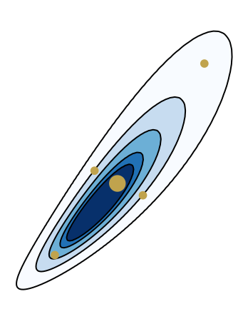{width="15%"} 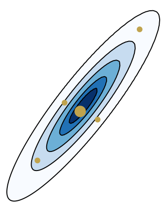{width="15%"}

- [Prior linearization filter]{.alertred}
  - Linearize by statistical linear regression.
  - Linearizes $\boldsymbol{y}=\boldsymbol{g}(\boldsymbol{\theta})$ by minimizing $\mathbb{E_{\mathrm{prior}}}\left(\left\Vert \boldsymbol{g}(\boldsymbol{\theta})-(\boldsymbol{\boldsymbol{a}+C}\boldsymbol{\theta})\right\Vert ^{2}\right)$.
  
  
:::

::: {.column width="30%"}

<div style="height:0em;"></div>


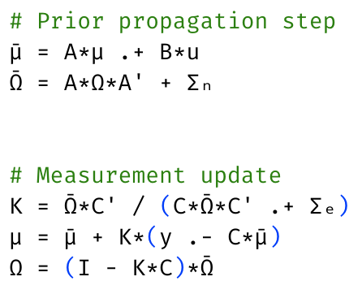 

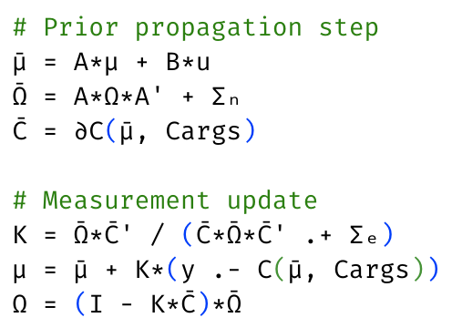


:::

::::

## Simulated example SAR(2,2) - MCMC convergence

{width="100%" style="display: block; margin: auto;"}


## Iterated Gaussian approximation filters

- Nonlinear Gaussian models

  - [Iterated extended Kalman filter]{.alertred} [@skoglund2015extended]

  - [Iterated unscented Kalman filter]{.alertred} [@skoglund2019iterative]

  - [Posterior linearization filter]{.alertred} [@garcia2015posterior]<br>
    Linearizes $\boldsymbol{y}=\boldsymbol{g}(\boldsymbol{\theta})$ by minimizing $\mathbb{E_{\mathrm{post}}}\left(\left\Vert \boldsymbol{g}(\boldsymbol{\theta})-(\boldsymbol{\boldsymbol{a}+C}\boldsymbol{\theta})\right\Vert ^{2}\right)$.
  
- Non-Gaussian models

  - [Posterior linearization filter - conditional moments version]{.alertred} [@tronarp2018iterative]<br>
    Statistical linearization using $\mathbb{E}(Y \vert \v x)$  and $\mathbb{V}(Y \vert \v x)$.
  
  - [Laplace filter]{.alertred} [@shephard1997likelihood; @koyama2010approximate]
    - Direct Gaussian approximation of filtering posterior at every $t$
      $$
      \v{\theta}_{t} \vert y_{1:t} \overset{\mathrm{approx}}{\sim} N(\tilde{\v{\theta}}_{t \vert t},     \tilde{\v{\Omega}}_{t\vert t})
    $$
    where $\tilde{\v\theta}_{t\vert t}$ is posterior mode and $\tilde{\v\Omega}_{t\vert t}$ is inverse of observed information.
    - [Automatic differentiation]{.alertred} makes it ... well ... automatic.
    
    
## Simulated Poisson regression illustration

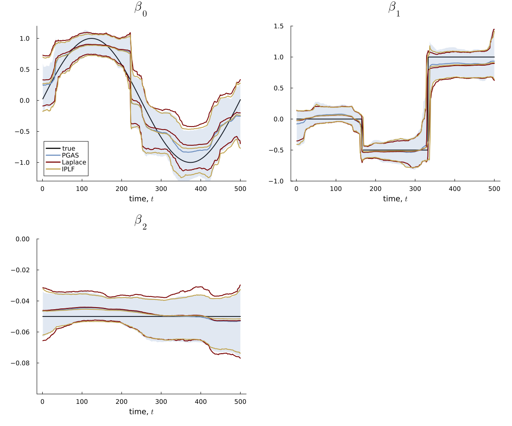{fig-align="center"}

## Time-varying Beta regression for US layoff proportion

- Beta regression
$$
\begin{aligned}
y_t \vert \v x_{t} &\sim \mathrm{Beta}\big(\mu_t = \mathrm{logistic}(\v x_{t}^\top\v\beta_{t}), \, \phi_t \big) 
\end{aligned}
$$

- Monthly US data from 1990:1-2026:4
  - `layoff` - job losers on layoff as % of total unemployed
  - `vix` - CBOE Volatility Index ("fear index")
  
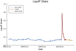{width="40%" fig-align="center"} 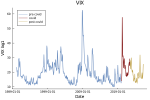{width="40%" fig-align="center"}

## Beta regression for US layoff proportion - DSP prior

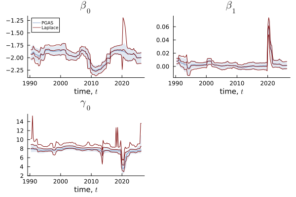{width="80%" fig-align="center"}

## Linear approximations struggle with Beta regression

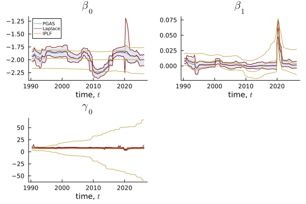{width="80%" fig-align="center"}

## Beta regression for US layoff proportion - homoscedastic Gauss prior

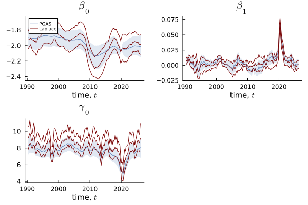{width="80%" fig-align="center"}

## Beta regression for US layoff - fit at posterior median around pandemic 

<table style="width:100%; border:none;">
  <tr>
    <th style="text-align:center; font-weight:500; font-style:normal;">[DSP]{.alertred}</th>
    <th style="text-align:center; font-weight:500; font-style:normal;">[Homoscedastic Gaussian]{.alertred}</th>
  </tr>
  <tr>
    <td style="text-align:center; border:none;">
      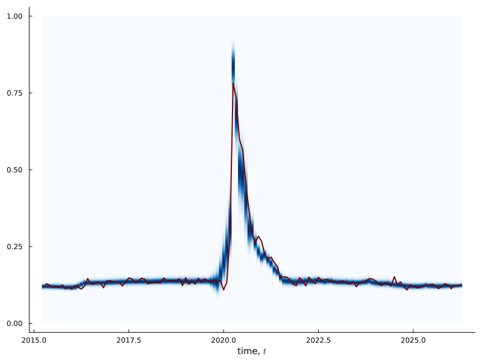
    </td>
    <td style="text-align:center; border:none;">
      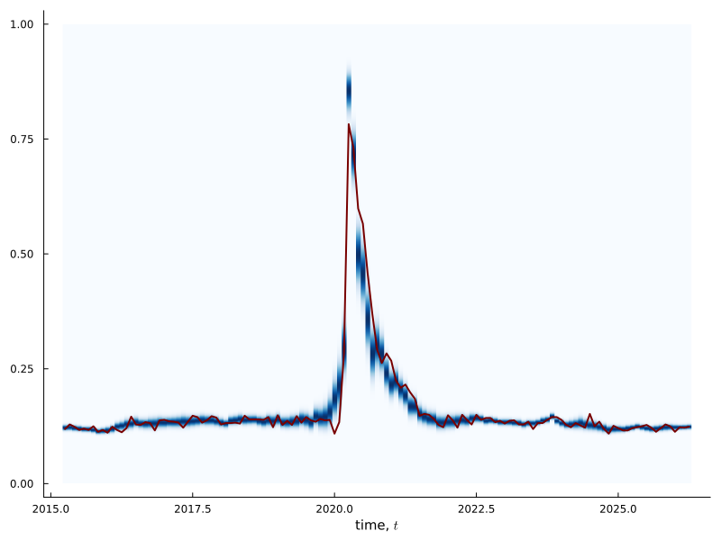
    </td>
  </tr>
</table>

## How Gaussian are we at each time step?


- Gaussian approximations at every time $t$. 

- How Gaussian are the [likelihood contributions]{.alertred} $p(y_t\vert\v\theta_t)$ in $\v\theta_t$?

- No asymptotic Bernstein-von Mises effect to help.

- A tight propagated prior $\v\theta_t \sim N(\hat{\v\theta}_{t\vert t-1}, \Omega_{t \vert t-1} )$ helps a lot.

- But DSP can give large innovations, so $\Omega_{t \vert t-1}$ can be large.


[Poisson model]{.alertred}

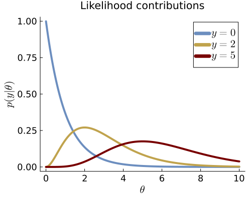{width="30%"} 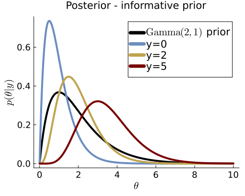{width="30%"}
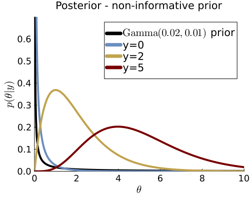{width="30%"}


## Grouping

:::: {.columns}

::: {.column width="80%"}

- [Group observations]{.alertred} in $G$ groups of $J_g$ observations in group $g$. 
- [Same state $\v\theta_g$ for observations within a group]{.alertred}.

$$
\begin{aligned}
y_{gj} \vert \v x_{gj} &\sim \mathrm{ExpFamily}\Big(k(\v x_{gj}^\top\v\beta_{g}), \varphi_{g}  \Big) \\
\v\beta_{g} &= \v\beta_{g-1}+\boldsymbol{\nu}_{g},\hspace{2cm} 
\v\nu_{g}\overset{\mathrm{iid}}{\sim}N\big(\v 0,\mathrm{Diag}(\exp(\v\tau^2 \odot  \v h_g))\big) \\
\v h_g &= \Phi \v h_{g-1} + \v\eta_g,\hspace{1.6cm} \eta_{g} \overset{\mathrm{iid}}{\sim}Z(\alpha,\beta,0,1)
\end{aligned}
$$
where $j=1,\ldots,J_g$ for $g=1,\ldots,G$.

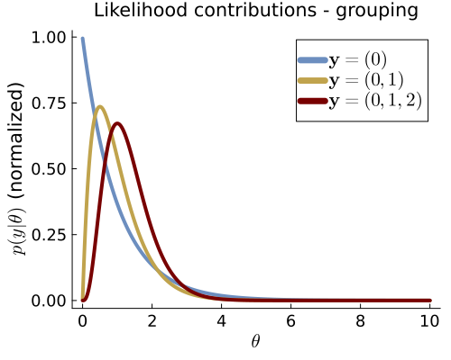{width="35%" fig-align="center"}

:::

::: {.column width="20%"}

> "When all the hope is gone, there is no reason for pessimism". <br>
> *Aki Kaurismäki*

::: 

:::

## Grouping observations

- Related ideas:
  - Improve Gaussianity in Subsampling MCMC/HMC [@salomone2020spectral]
  - Improve linearity/Gaussianity in filtering [@raitoharju2024stacked]
  - Modeling moderate time evolutions [@celanimoderatetime]
  
::: tinyskip
:::

- Two views: 
  - interpolation for algorithmic performance
  - genuine model change: different time scales for observations and parameters.
  
::: tinyskip
:::

- [Parameter evolution is automatically adapted]{.alertred} to different group sizes.

- [Massive speed-up]{.alertred}, particularly for sub-daily data. 

- Example: 30 min electricity price. Group $48\times 30 = 1440$ observations by month.

- Large groups: Sequential filtering of individual observations within group.


## Simulated Poisson regression illustration - no grouping

{fig-align="center"}


## Simulated Poisson regression illustration - group of three

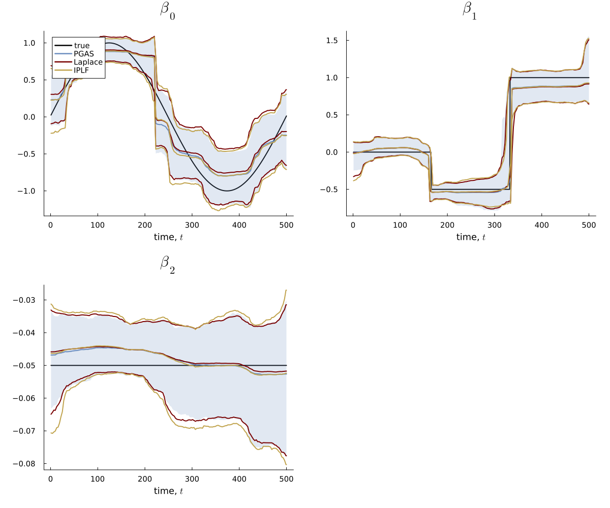{fig-align="center"}

## Natural parameter innovations

- Parameter evolution should adapt to:
  - Scales of covariates
  - Link functions
  - Model geometry
  
- [Natural gradients]{.alertred} [@amari1998natural; @amari1982differential] in optimization. 

$$
\v x_{j+1} = \v x_j - \gamma \red{\v I(\v x_j)^{-1}}\nabla f(\v x_j)
$$

- [Fisher metric]{.alertred}. Step sizes scaled with respect to model geometry.

## Scaled innovations controls Kullback-Leibler divergence over time


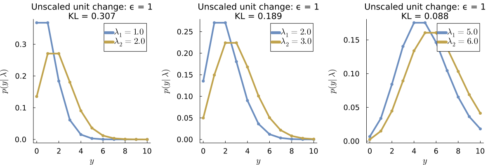{width="65%" fig-align="center"}

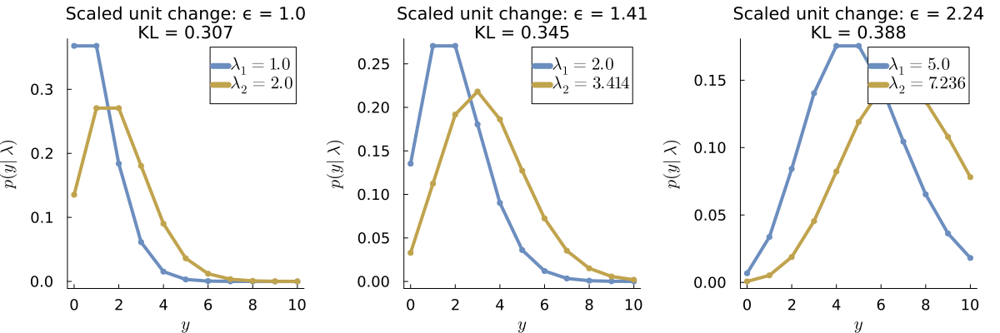{width="65%" fig-align="center"}

## Natural parameter innovations

- Parameter evolution with [natural innovations]{.alertred}
$$
\begin{aligned}
y_t \vert \v x_{t} &\sim \mathrm{ExpFamily}\Big(k(\v x_{t}^\top\v\beta_{t}), \varphi_t  \Big) \\
\v\beta_{t} &= \v\beta_{t-1}+\v S(\v\beta_{t-1}) \v\nu_{t},
\end{aligned}
$$
where $\v S(\v\beta_{t-1}) = \bar{I}^{-1/2}(\v\beta_{t-1})$


- $\bar{I}(\v\beta) = \frac{1}{T}I(\v\beta)$ is the [Fisher information]{.alertred} from an "average" observation.


- Non-linear transition model. Prior propagation step: $S(\v\beta_{t-1}) \approx S(\hat{\v\beta}_{t-1 \vert t-1})$.


- Prior at time $t=0$
$$
\v\beta_0 \sim N\Big(\v \mu_0, \frac{T}{\kappa_0}\bar{I}^{-1}(\v\mu_0)\Big)
$$
where $\v\mu_0$ is backed out from beliefs about the data at time $t=0$. 


## Natural parameter innovations - Poisson($\exp(\theta)$)


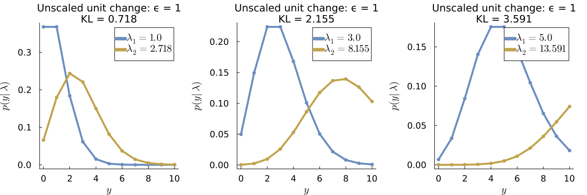{width="70%" fig-align="center"}

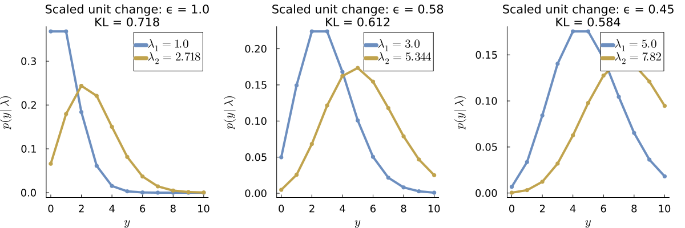{width="70%" fig-align="center"}


## Ongoing and future work

- [Multivariate]{.alertred} extensions

::: tinyskip
:::

- [Forecasting]{.alertred}

::: tinyskip
:::

- More [efficient sampling of DSP part]{.alertred}

::: tinyskip
:::

- Better [prior elicitation for DSP part]{.alertred}

  
::: tinyskip
:::

- [Posterior perturbation bounds]{.alertred} from the true target posterior

::: tinyskip
:::

- [Metropolis-Hastings correction]{.alertred} by blocking the state. Filtering version of [@shephard1997likelihood]

::: tinyskip
:::

- [Delayed rejection]{.alertred}: 
  - first try with cheap proposal (e.g. EKF) 
  - if rejected try more expensive proposal (e.g. Iterated EKF with line search)


## References {.smaller}
